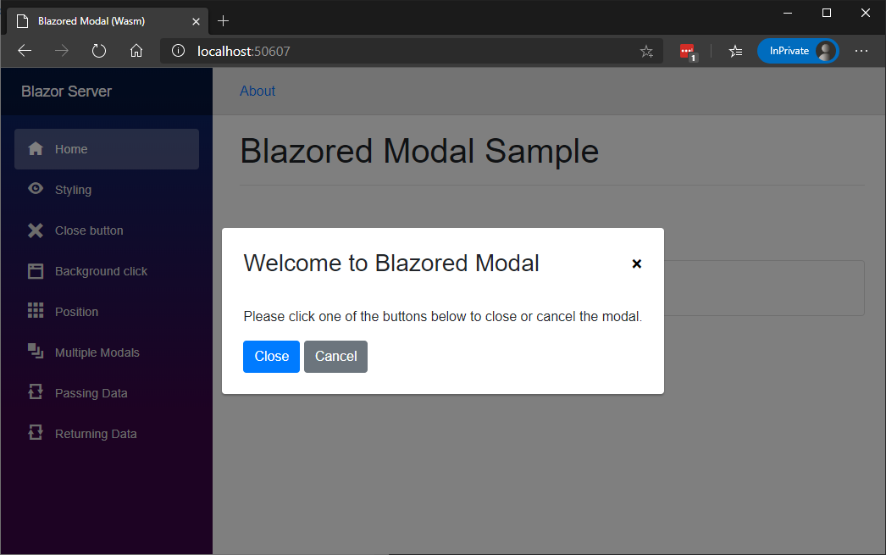

# Blazored Modal

A beautiful and customizable modal implementation for [Blazor](https://blazor.net) and Razor Components applications. It's free-range, gluten-free and 100% JavaScript free.

[](https://dev.azure.com/blazored/Modal/_build/latest?definitionId=4&branchName=master)




## Getting Setup

You can install the package via the nuget package manager just search for *Blazored.Modal*. You can also install via powershell using the following command.

```powershell
Install-Package Blazored.Modal
```

Or via the dotnet CLI.

```bash
dotnet add package Blazored.Modal
```

### 1. Register Services

You will need to add the following line to your applications `Startup.ConfigureServices` method.

```csharp
public void ConfigureServices(IServiceCollection services)
{
    services.AddBlazoredModal();
}
```

### 2. Add Imports

Add the following to your *_Imports.razor*

```csharp
@using Blazored
@using Blazored.Modal
@using Blazored.Modal.Services
```

### 3. Add Modal Component

Add the `<BlazoredModal />` tag into your applications *MainLayout.razor*.

### 4. Add reference to style sheet

Add the following line to the `head` tag of your `_Host.cshtml` (Blazor Server app).

```html
<link href="_content/Blazored.Modal/blazored-modal.css" rel="stylesheet" />
```

## Usage

### Displaying the modal

In order to show the modal, you have to inject the `IModalService` into the component or service you want to invoke the modal. You can then call the `Show` method passing in the title for the modal and the type of the component you want the modal to display.

For example, say I have a component called `Movies` which I want to display in the modal and I want to call it from the `Index` component on a button click.

```html
@page "/"
@inject IModalService Modal

<h1>Hello, world!</h1>

Welcome to Blazored Modal.

<button @onclick="@(() => Modal.Show("My Movies", typeof(Movies)))" class="btn btn-primary">View Movies</button>
```

### Passing Parameters

If you need to pass values to the component you are displaying in the modal, then you can use the `ModalParameters` object. Any component which is displayed in the modal has access to this object as a `[CascadingParameter]`.

#### Index Component

```html
@page "/"
@inject IModalService Modal

<h1>My Movies</h1>

<ul>
    @foreach (var movie in Movies)
    {
        <li>@movie.Name (@movie.Year) - <button @onclick="@(() => ShowEditMovie(movie.Id))" class="btn btn-primary">Edit Movie</button></li>
    }
</ul>

@code {

    List<Movies> Movies { get; set; }

    void ShowEditMovie(int movieId)
    {
        var parameters = new ModalParameters();
        parameters.Add("MovieId", movieId);

        Modal.Show("Edit Movie", typeof(EditMovie), parameters);
    }

}
```

#### EditMovie Component

```html
@inject IMovieService MovieService
@inject IModalService ModalService

<div class="simple-form">

    <div class="form-group">
        <label for="movie-name">Movie Name</label>
        <input @bind="@Movie.Name" type="text" class="form-control" id="movie-name" />
    </div>

    <div class="form-group">
        <label for="year">Year</label>
        <input @bind="@Movie.Year" type="text" class="form-control" id="year" />
    </div>

    <button @onclick="@SaveMovie" class="btn btn-primary">Submit</button>
    <button @onclick="@Cancel" class="btn btn-secondary">Cancel</button>
</div>

@code {

    [CascadingParameter] ModalParameters Parameters { get; set; }

    int MovieId { get; set; }
    Movie Movie { get; set; }

    protected override void OnInit()
    {
        MovieId = Parameters.Get<int>("MovieId");
        LoadMovie(MovieId);
    }

    void LoadMovie(int movieId)
    {
        MovieService.Load(movieId);
    }

    void SaveMovie()
    {
        MovieService.Save(Movie);
        ModalService.Close(ModalResult.Ok<Movie>(Movie));
    }

    void Cancel()
    {
        ModalService.Cancel();
    }

}
```

### Modal Closed Event

If you need to know when the modal has closed, for example to trigger an update of data. The modal service exposes a `OnClose` event which returns a `ModalResult` type. This type is used to identify how the modal was closed. If the modal was cancelled you can return `ModalResult.Cancelled()`. If you want to return a object from your modal you can return `ModalResult.Ok(myResultObject)` which can be accessed via the `ModalResult.Data` property. There is also a `ModalResult.DataType` property which contains the type of the data property, if required.

```html
@page "/"
@inject IModalService Modal

<h1>My Movies</h1>

<button @onclick="@ShowModal" class="btn btn-primary">View Movies</button>

@code {

    void ShowModal()
    {
        Modal.OnClose += ModalClosed;
        Modal.Show("My Movies", typeof(Movies));
    }

    void ModalClosed(ModalResult modalResult)
    {
        if (modalResult.Cancelled)
        {
            Console.WriteLine("Modal was cancelled");
        }
        else
        {
            Console.WriteLine(modalResult.Data);
        }

        Modal.OnClose -= ModalClosed;
    }

}
```

### Customizing the modal

The modals can be customized to fit a wide variety of uses. These options can be set globally or changed programatically.

#### Hiding the close button

A modal has a close button in the top right hand corner by default. The close button can be hidden by using the `HideCloseButton` parameter:

`<BlazoredModal HideCloseButton="true" />`

Or in the `Modal.Show()` method:

```csharp
@code {
    void ShowModal()
    {
        var options = new ModalOptions()
        {
            HideCloseButton = false
        };

        Modal.Show("My Movies", typeof(Movies), options);
    }
}
```

#### Disabling background click cancellation

You can disable cancelling the modal by clicking on the background using the `DisableBackgroundCancel` parameter.

`<BlazoredModal DisableBackgroundCancel="true" />`

Or in the `Modal.Show()` method:

```csharp
@code {
    void ShowModal()
    {
        var options = new ModalOptions()
        {
            DisableBackgroundCancel = true
        };

        Modal.Show("My Movies", typeof(Movies), options);
    }
}
```

#### Styling the modal

You can set an alternative CSS style for the modal if you want to customize the look and feel. This is useful when your web application requires different kinds of modals, like a warning, confirmation or an input form.

Use the `Style` parameter to set the custom styling globally:

`<BlazoredModal Style="custom-modal" />`

Or in the `Modal.Show()` method:

```csharp
@code {
    void ShowModal()
    {
        var options = new ModalOptions()
        {
            Style = "blazored-modal-movies"
        };

        Modal.Show("My Movies", typeof(Movies), options);
    }
}
```

#### Setting the position

Modals are shown in the center of the viewport by default. The modal can be shown in different positions if needed. The positioning is flexible as it is set using CSS styling.

The following positioning styles are available out of the box: `blazored-modal-center`, `blazored-modal-topleft`, `blazored-modal-topright`, `blazored-modal-bottomleft` and `blazored-modal-bottomright`.

Use the `Style` parameter to set the custom styling globally:

`<BlazoredModal Position="blazored-modal-bottomleft" />`

Or in the `Modal.Show()` method:

```csharp
@code {
    void ShowModal()
    {
        var options = new ModalOptions()
        {
            Position = "blazored-modal-bottomleft"
        };

        Modal.Show("My Movies", typeof(Movies), options);
    }
}
```
